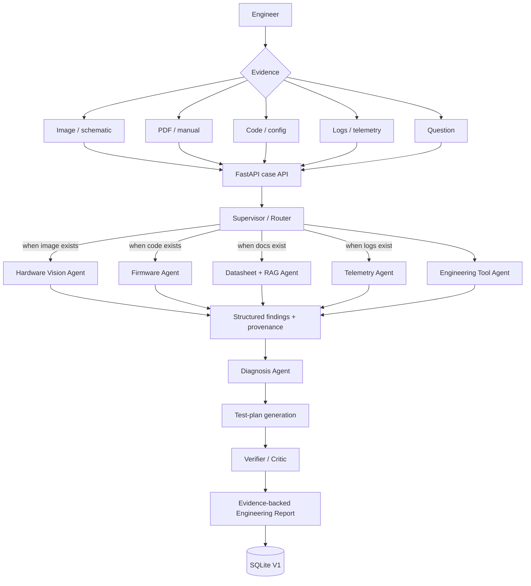
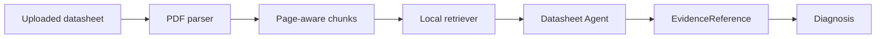

<div align="center">

# BenchMind AI

### Evidence-grounded multimodal engineering debugging with specialist agents

**Hardware photos · Schematics · Firmware · Datasheets · Logs · Telemetry → diagnosis, verification, and test plan**

[](https://github.com/othmanayari049-wq/BenchMind-AI/actions/workflows/ci.yml)
[](LICENSE)

</div>

BenchMind AI is an open-source engineering diagnostic workspace for debugging embedded systems and electronics from **multiple forms of evidence**. It routes only the specialists a case needs, combines deterministic engineering tools with retrieval and multimodal models, challenges the proposed diagnosis with a verifier, and returns a traceable engineering report instead of an unsupported chatbot answer.

> [!IMPORTANT]
> BenchMind is an engineering assistant, not a safety-certified diagnostic system. Independently verify all recommendations, especially around mains voltage, batteries, high current, motors, machinery, high voltage, or other hazardous systems.

## Why BenchMind?

Real debugging rarely starts with one clean prompt. A failure can be split across firmware pin definitions, a breadboard photo, a datasheet electrical limit, a serial log, and the physical wiring. A single unrestricted prompt also makes it difficult to distinguish **what was observed** from **what the model inferred**.

BenchMind makes those boundaries explicit:

- **Observation** — directly extracted or visibly observed evidence.
- **Fact** — a supported engineering statement tied to a source.
- **Inference** — a reasoned consequence of evidence.
- **Hypothesis** — a candidate root cause that can still be disproved.
- **Recommendation** — a proposed action or test, never silently upgraded into a fact.

If the evidence cannot support a root cause, BenchMind says that more evidence is required.

## V1 capabilities

| Capability | Status | Notes |
|---|---:|---|
| Natural-language engineering questions | ✅ | FastAPI + web UI |
| Arduino/C/C++/Python/config uploads | ✅ | Parsed as engineering evidence |
| Serial/build logs | ✅ | Deterministic parsing for known patterns |
| CSV telemetry | ✅ | Accepted as evidence; deeper signal analytics are roadmap |
| PDF manuals/datasheets | ✅ | Text extraction + page-aware local retrieval |
| Hardware images | ✅* | Real image inspection requires configured model provider |
| Supervisor routing | ✅ | Invokes only relevant specialists |
| Concurrent specialist analysis | ✅ | Bounded async concurrency |
| Deterministic engineering tools | ✅ | Ohm's law, power, divider, I²C/baud/pin parsing |
| Diagnosis + alternatives schema | ✅ | Structured Pydantic models |
| Verifier / critic | ✅ | Challenges weakly supported hypotheses |
| Source provenance | ✅ | Evidence IDs, filenames, PDF pages/excerpts where available |
| Local persistence | ✅ | SQLite V1 store |
| MCP engineering tools | ✅ | Optional MCP extra |
| Arbitrary uploaded-code execution | ❌ | Intentionally disabled until isolated sandboxing exists |
| Live serial / ROS / STM32 / FPGA | Planned | V2/V3 roadmap |

`*` Offline/mock mode remains fully usable for deterministic demo cases without a paid API.

## Architecture



Specialists are not decorative prompts. They have separate responsibilities, evidence contracts, and routing criteria. Independent specialists execute concurrently; diagnosis and verification execute in sequence because the verifier must challenge an already-formed hypothesis.

## Agent responsibilities

| Agent | Responsibility |
|---|---|
| Supervisor / Router | Select the minimum useful specialist set from the evidence types |
| Hardware Vision | Report visible hardware/schematic observations without inventing hidden connections |
| Firmware | Extract pin definitions, serial configuration, and error evidence from code/config |
| Datasheet | Retrieve relevant document passages with provenance |
| Telemetry | Extract I²C addresses, baud configuration, and logged errors |
| Engineering Tools | Run deterministic parsers/calculations instead of asking an LLM to calculate |
| Diagnosis | Synthesize candidate root causes from cross-evidence agreement/disagreement |
| Verifier | Search for weak support, contradictions, missing independent evidence, and unresolved uncertainty |
| Reporter | Produce the final structured report and evidence list |

## Example diagnosis

The built-in ESP32/HC-SR04 case contains:

```text
firmware.ino: ECHO_PIN = GPIO18
wiring.txt:   ECHO -> GPIO5
```

BenchMind detects the cross-source disagreement, forms **ECHO pin-definition mismatch** as the primary hypothesis, requires a powered-off continuity/wiring check, and tells the user to align firmware and physical wiring only after verification.

Run it without an API key:

```bash
curl -X POST http://localhost:8000/api/v1/demo/esp32_wrong_gpio
```

Other included fixture cases cover baud mismatch, I²C address mismatch, and missing common ground.

## Quick start

### Prerequisites

- Python 3.11+
- Node.js 22+
- npm
- Optional: Docker / Docker Compose
- Optional: OpenAI API key for real image inspection

### Local development

```bash
git clone https://github.com/othmanayari049-wq/BenchMind-AI.git
cd BenchMind-AI
cp .env.example .env

python -m venv .venv
source .venv/bin/activate   # Windows: .venv\Scripts\activate
python -m pip install -e '.[dev]'

cd frontend
npm install
cd ..
```

Start the API:

```bash
uvicorn benchmind.api:app --app-dir backend --reload --port 8000
```

Start the UI in another terminal:

```bash
cd frontend
npm run dev
```

Open `http://localhost:3000`.

## Docker

```bash
cp .env.example .env
docker compose up --build
```

Services:

- UI: `http://localhost:3000`
- API: `http://localhost:8000`
- OpenAPI docs: `http://localhost:8000/docs`

## Model configuration

Offline deterministic mode is the default:

```env
BENCHMIND_MODEL_PROVIDER=mock
```

For real image inspection with OpenAI:

1. Create an API key from the official OpenAI API dashboard: `https://platform.openai.com/api-keys`.
2. Install the optional provider dependency: `python -m pip install -e '.[openai]'`.
3. Put the key only in your local `.env`; never commit it.
4. Select the provider and model:

```env
BENCHMIND_MODEL_PROVIDER=openai
OPENAI_API_KEY=sk-...
BENCHMIND_OPENAI_MODEL=gpt-5.6-luna
```

BenchMind uses a provider abstraction, so future providers can implement the same `ModelProvider` boundary without rewriting the orchestration layer.

## API

### Analyze a case

```bash
curl -X POST http://localhost:8000/api/v1/analyze \
  -F 'question=My ultrasonic sensor always reads zero. What is wrong?' \
  -F 'files=@examples/esp32_wrong_gpio/firmware.ino' \
  -F 'files=@examples/esp32_wrong_gpio/wiring.txt'
```

### Retrieve a stored case

```bash
curl http://localhost:8000/api/v1/cases/<case-id>
```

### Inspect V1 vs planned capabilities

```bash
curl http://localhost:8000/api/v1/capabilities
```

## Engineering-document RAG

V1 uses local provenance-aware lexical retrieval. PDF text is extracted, chunked, and retrieved by query overlap while preserving page metadata when feasible.



This design deliberately keeps the offline workflow deterministic. An embedding/vector backend can replace the local scorer behind the same retrieval boundary later. See [`docs/rag.md`](docs/rag.md).

## Engineering MCP server

Install the MCP extra:

```bash
python -m pip install -e '.[mcp]'
benchmind-mcp
```

V1 exposes only tools that can be implemented correctly and safely without hardware access:

- `calculate_voltage_divider`
- `calculate_ohms_law`
- `calculate_power`
- `analyze_i2c_scan`
- `parse_serial_configuration`

`run_python()`, arbitrary compilation, serial-device control, and similar capabilities are **not faked**. They remain blocked until an isolated execution architecture exists.

## Security

BenchMind currently validates upload extensions and size, sanitizes filenames, avoids host shell execution, keeps secrets in environment variables, and exposes deterministic MCP tools only.

The system **does not execute arbitrary uploaded code in V1**. Any future compiler or runtime adapter must run inside a restricted sandbox with explicit resource, filesystem, network, and timeout controls. See [`docs/security.md`](docs/security.md).

## Benchmarks and evaluation

Benchmark fixtures live under `benchmarks/cases/`. Each case defines its known fault, expected root-cause text, evidence files, and expected diagnostic test.

```bash
PYTHONPATH=backend python benchmarks/evaluate.py
```

> [!NOTE]
> The current fixtures validate pipeline behavior. **No real-world root-cause accuracy, Top-K accuracy, false-diagnosis rate, or verifier-success percentage is claimed yet.** Those numbers require a larger blinded evaluation set.

Planned evaluation dimensions include:

- root-cause accuracy
- Top-K diagnostic accuracy
- false-diagnosis rate
- evidence-grounding accuracy
- citation correctness
- tool-selection accuracy
- verifier success rate
- agent/tool steps
- latency
- token/API cost

See [`docs/benchmarks.md`](docs/benchmarks.md).

## Testing and quality

```bash
pytest
ruff check backend tests
ruff format --check backend tests
mypy backend/benchmind

cd frontend
npm run typecheck
npm run build
```

GitHub Actions runs backend lint/type/tests/fixtures and the frontend typecheck/build on pushes and pull requests.

## Project structure

```text
BenchMind-AI/
├── backend/
│   └── benchmind/
│       ├── agents/          # routing, specialists, diagnosis, verifier, reporter
│       ├── providers/       # model-provider abstraction
│       ├── tools/           # deterministic engineering tools
│       ├── api.py           # FastAPI surface
│       ├── evidence.py      # validation, classification, extraction
│       ├── models.py        # structured agent/evidence/report contracts
│       ├── orchestrator.py  # concurrent specialist execution
│       ├── rag.py           # V1 provenance-aware retrieval
│       ├── storage.py       # SQLite persistence boundary
│       └── mcp_server.py    # engineering MCP tools
├── frontend/                # Next.js engineering workspace
├── benchmarks/              # fixture cases + evaluator
├── examples/                # realistic runnable cases
├── tests/                   # unit, API, RAG, orchestration tests
├── docs/                    # architecture, security, RAG, roadmap
├── .github/                 # CI and contribution templates
└── docker-compose.yml
```

## Roadmap

### V1 — foundation

- [x] text, code, logs, CSV/config evidence
- [x] PDF extraction and local retrieval
- [x] real image-provider integration path
- [x] specialized routed agents
- [x] deterministic engineering tools
- [x] diagnosis + verifier + test plan
- [x] FastAPI and Next.js workspace
- [x] benchmark framework
- [x] MCP deterministic tools
- [x] Docker and CI configuration

### V2

- [ ] isolated code sandbox
- [ ] Arduino/ESP32 compilation adapters
- [ ] repository-level analysis
- [ ] richer schematic understanding
- [ ] ROS log adapters
- [ ] explicit token/cost accounting

### V3

- [ ] serial-port integration and live telemetry
- [ ] Raspberry Pi / STM32 workflows
- [ ] voice and mobile-camera workflow
- [ ] robotics debugging
- [ ] Verilog/VHDL/FPGA tooling

### V4

- [ ] collaborative engineering workspaces
- [ ] hardware-in-the-loop testing
- [ ] richer MCP ecosystem
- [ ] community agent/plugin system

## Contributing

Contributions are welcome. Start with [`CONTRIBUTING.md`](CONTRIBUTING.md), the architecture notes, and an issue describing the engineering behavior you want to add. New agents and tools should include tests and evidence contracts rather than only prompt changes.

## License

Apache License 2.0. See [`LICENSE`](LICENSE).

## Technical references

BenchMind's implementation choices are informed by the official documentation for:

- OpenAI Responses / model guidance: `https://developers.openai.com/api/docs/`
- OpenAI Python SDK / Responses API: `https://github.com/openai/openai-python`
- Model Context Protocol Python SDK: `https://py.sdk.modelcontextprotocol.io/`
- FastAPI: `https://fastapi.tiangolo.com/`
- Next.js: `https://nextjs.org/docs`

---

<div align="center"><strong>BenchMind AI</strong> — debug the evidence, challenge the hypothesis, verify the fix.</div>
