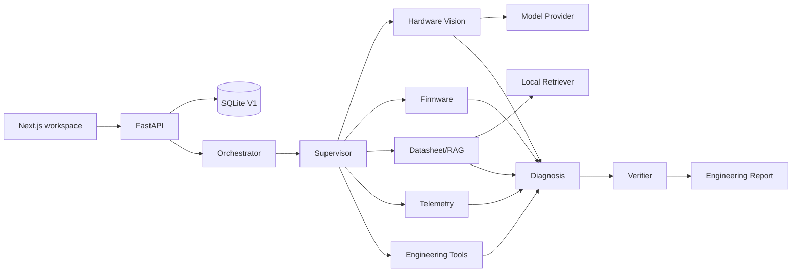

# Architecture

BenchMind V1 is a modular monolith with explicit boundaries so model providers, storage, retrieval, and tool execution can evolve independently.

## Routing

The supervisor routes from evidence types. Specialists run concurrently when independent. Diagnosis and verification are sequential because the verifier challenges an already-formed hypothesis.

## Evidence model

Every reusable finding has a claim type and explicit references. The report does not treat model output as fact merely because a model produced it.

## Provider boundary

`ModelProvider` isolates vendor-specific multimodal inference. `MockProvider` is offline. `OpenAIProvider` currently implements image inspection through the Responses API. Additional providers can implement the same interface.

## Persistence

SQLite is intentionally used for V1 local development. The storage boundary is small enough to replace with PostgreSQL when collaborative workspaces, auth, or multi-instance deployment arrive.

## Why a small custom orchestrator in V1

BenchMind does not depend on an agent framework for its core routing loop. V1 needs a narrow sequence: deterministic evidence routing, bounded concurrent specialists, diagnosis, then adversarial verification. A small typed orchestrator makes those transitions explicit and keeps the evidence/provenance contracts independent of any model vendor or agent runtime. The OpenAI Agents SDK remains compatible with future provider-specific or long-running workflows, but adding it to the core today would not solve a missing V1 requirement.
